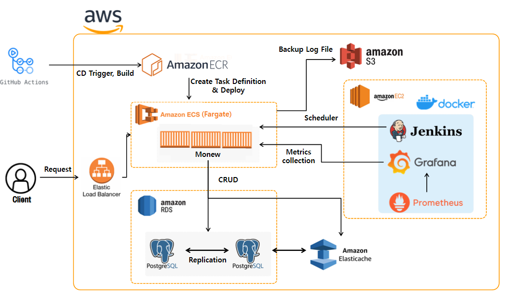

<h2>Monew </h2>

여러 뉴스 API를 통합하여 사용자에게 맞춤형 뉴스를 제공하고, 의견을 나눌 수 있는 소셜 기능을 갖춘 서비스를 제공

## 개요
- 프로젝트 이름: Monew 🏠
- 프로젝트 지속기간: 2025.05-2025.06
- 개발 엔진 및 언어:               
- 멤버: 김세은, 김지협, 심민혁, 양진호, 양찬혁

## 프로젝트 설치 방법
1. git clone [주소]
2. 환경 변수 파일 만들기
3. docker compose up -d

## 시스템 아키텍처

## 시스템 설명
여러 뉴스 API를 통합하여 사용자에게 맞춤형 뉴스를 제공하고, 의견을 나눌 수 있는 소셜 기능을 갖춘 서비스를 제공

## API 문서
#### 백업 관리
-   `POST /api/backup/restore`  - 백업 복원

### 사용자 관리

-   `POST /api/users`  - 회원가입
-   `POST /api/users/login`  - 로그인
-   `PATCH /api/users/{userId}`  - 프로필 수정
-   `DELETE /api/users/{userId}`  - 회원탈퇴

### 뉴스 기사
-   `GET /api/articles`  - 기사 목록 조회
-   `POST /api/articles/{articleId}/article-views`  - 조회수 증가
-   `GET /api/articles/sources`  - 뉴스 소스 목록
-   `GET /api/articles/restore`  - 데이터 복원

### 댓글 시스템

-   `GET /api/comments`  - 댓글 목록
-   `POST /api/comments`  - 댓글 작성
-   `POST /api/comments/{commentId}/comment-likes`  - 댓글 좋아요

### 관심사 관리

-   `POST /api/interests`  - 관심사 등록
-   `GET /api/interests`  - 관심사 검색
-   `POST /api/interests/{interestId}/subscriptions`  - 구독

### 알림

-   `GET /api/notifications`  - 알림 목록
-   `PATCH /api/notifications`  - 알림 읽음 처리

### 사용자 통계

-   `GET /api/user-activities/{userId}`  - 활동 통계

## 트러블 슈팅
### Cache Stampede 방지 및 캐시 신뢰성 강화

- **발생한 문제**  
  Redis 도입 후 성능 테스트 중, 동시 다수 요청 시 캐시 미스 발생으로 DB로 트래픽이 집중되어 과부하 발생 (Cache Stampede)

- **원인 분석**  
  캐시 미스 시 모든 동시 요청이 DB를 중복 조회 → 단일 잠금·Pub/Sub·분산 락 등 다양한 완화책을 검토했으나 한계 존재

- **배운 점 및 개선 사항**  
  Redisson 분산 락 기반 캐시 제어 + Redis Pub/Sub 전략 적용
    - 다중 ECS 인스턴스 환경에서 캐시 재생성을 단일 인스턴스가 담당
    - 나머지 인스턴스는 Pub/Sub로 동기화

- **해결 방안**
    1. 하나의 인스턴스만 DB 접근 및 캐시 재생성 담당
    2. 나머지는 Pub/Sub 수신 후 캐시 재활용
    - Cache Stampede 현상 완전 제거
    - 재생성 타이밍 안정화
    - 모니터링 로직 추가 운영

### RDS Read Replica를 통한 조회 트래픽 분산 및 장애 대처

- **발생한 문제**  
  캐시 미스·히트율 변화 시 API 조회 트래픽이 RDS Master에 집중되어 읽기 부하 및 순간적 성능 저하 발생

- **원인 분석**  
  읽기 트래픽의 절대량이 커 Master 단독으로는 부하 분산 한계 → 캐시 누락 시 부하 집중

- **배운 점 및 개선 사항**  
  RDS Read Replica 구성으로 읽기 부하 분산
    - 읽기/쓰기 동기화 및 복제 지연(replication lag) 관리
    - 장애 시 Replica 프로모션 대응 시나리오 수립 필요

- **해결 방안**
    1. 일부 읽기 API에 Read Replica 적용
    2. 복제 지연 모니터링 체계 구축
    3. 장애 시 자동 Failover(Replica Promotion) 및 알림/자동화 시스템 수립
